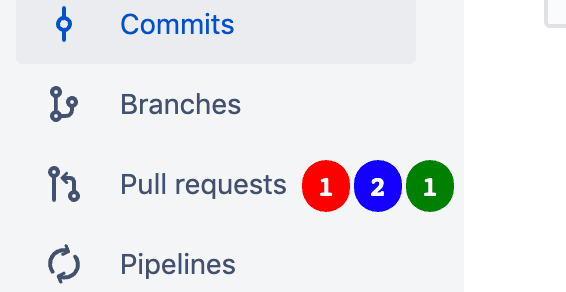

# Bitbucket.org

### Add PR Numbers
Add numbers to the PR tab in Bitbucket to show the following:
* how many PRs you have left to review
* how many PRs you have opened that _don't_ have at least two approvals
* how many PRs you have opened that _do_ have at least two approved

### Patch Notes
1.0.2 - fix "show my approved PRs"
1.0.1 - don't count PR as needing approval if it's already got two approvals
